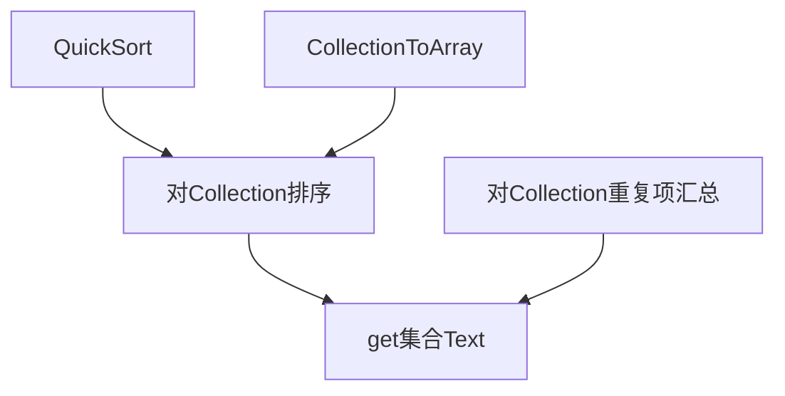

0 背景
====

1 开发原理
====
1.1 辅助模块:get集合Text
----


```vb
Sub Test()
    Dim c As New Collection
    c.add "苹果"
    c.add "苹果"
    c.add "梨"
    c.add "香蕉"
    c.add "梨"
    
    '不排序，计数
    Debug.Print get集合Text(c, False)               '苹果2, 梨2, 香蕉1
    '排序，计数
    Debug.Print get集合Text(c)                      '梨2, 苹果2, 香蕉1
    '不计数
    Debug.Print get集合Text(c, 重复项计数:=False)   '梨, 梨, 苹果, 苹果, 香蕉
    '更改分割符号
    Debug.Print get集合Text(c, 项分隔符:=";")       '梨2;苹果2;香蕉1
End Sub
```

1.2 一键多值字典:CKeyValuesDic
----


2 使用方法
====