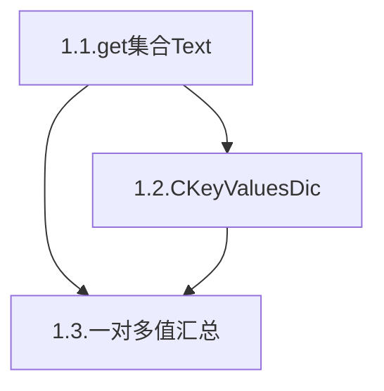
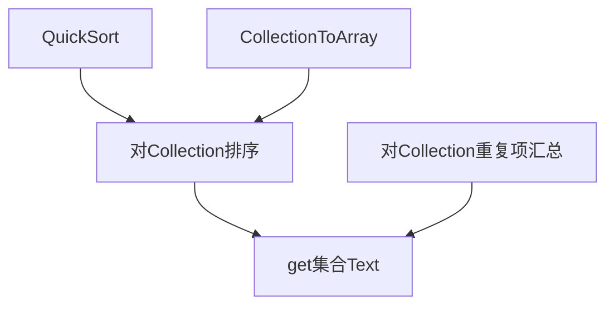
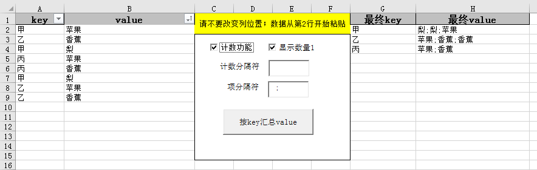

0.背景
====
最开始接触这类问题，是刚来铁塔不久，分析每个站点铁塔数的问题。
由于有些站铁塔数量，甚至类型不唯一，我想用"A3,B2"的格式来表示其涉及的种类及数量。当时的方法，是用数据透视表进行合并同类项与计数，然后借助函数得到结果，再用vlookup计算到相应的位置。

<!--TODO:加入那部分旧代码和效果插图 -->

后来帮助LJD中，又涉及此类问题，这时我已经会了字典，所以完成了未带计数，只有去重功能的基本代码。
后来结合《VBA其实很简单》对Controls的介绍，进行扩展开发完成功能。

11月09日发生我的电脑Excel不能使用中文模块名的BUG后，于11月25日重新整理了这部分代码，并用.md文档记录开发原理与使用方法。

1.开发组件介绍及使用方法
====


1.1.辅助模块:get集合Text
----


```vb
Sub Test()
    Dim c As New Collection
    c.add "苹果"
    c.add "苹果"
    c.add "梨"
    c.add "香蕉"
    c.add "梨"

    '不排序，计数
    Debug.Print get集合Text(c, False)               '苹果2, 梨2, 香蕉1
    '排序，计数
    Debug.Print get集合Text(c)                      '梨2, 苹果2, 香蕉1
    '不计数
    Debug.Print get集合Text(c, 重复项计数:=False)   '梨, 梨, 苹果, 苹果, 香蕉
    '更改分割符号
    Debug.Print get集合Text(c, 项分隔符:=";")       '梨2;苹果2;香蕉1
End Sub
```
get集合Text

| 参数名  | 默认值 | 说明   |
|-------|---|-----------|
| c  | 必填 |   要分析的Collection   |
| 排序 | True  | 按value名称进行升序排序,False时则按Collection中原来的顺序 |
| 重复项计数  | True | 如果有相同元素,则进行合并 |
| 项分隔符  | ", " |  |
| 重复项计数分隔符  | "" | 如果value本身后缀带数字,为了避免混淆,有时候要分隔符 |
| 数量1不显示 | False  | 重复项计数为True时，对数量只有1个的项目不显示数量1 |

1.2.一键多值字典:CKeyValuesDic
----
两个方法(sub)
1. Private Sub Class_Initialize()
	类初始化，建立一个用于存储的字典变量d，由key映射到一个Collection。
2. Add(key, value)
	增加映射值的方法，操作方法同普通的字典。但是代码实现中，实际上是将每个value存储在对应的Collection里。

三个属性(function)
1. getKeys() As Collection
	返回字典的所有key，方便进行for each遍历。
2. getValues(key) As Collection
 	返回某个key对应的所有value值。
3. Text(...) As String
	以文本的形式显示一键多值字典的内容。
    | 参数名  | 默认值 | 说明   |
    |-------|---|-----------|
    | 键与值的分隔符  | ": " |      |
    | 值与值的分隔符 | ", "  |       |
    | 记录分隔符  | vbCr   | 默认按换行符分开每个key-values对 |
    | 排序  | True |   按value名称进行升序排序   |
    | 重复项计数 | False  |       |
    | 重复项计数分隔符  | "" | 如果value本身后缀带数字,为了避免混淆,有时候要分隔符 |


```vb
Sub Test()
    Dim c As New CKeyValuesDic
    c.Add "甲", "苹果"
    c.Add "乙", "香蕉"
    c.Add "甲", "梨"
    c.Add "丙", "苹果"
    c.Add "丙", "香蕉"
    c.Add "甲", "梨"
    c.Add "乙", "苹果"
    c.Add "乙", "香蕉"

    Debug.Print "普通格式"
    Debug.Print c.Text
    Debug.Print "重复项计数"
    Debug.Print c.Text(重复项计数:=True)
End Sub
```
```Output
普通格式
甲: 苹果, 梨, 梨
乙: 香蕉, 苹果, 香蕉
丙: 苹果, 香蕉

重复项计数
甲: 苹果1, 梨2
乙: 香蕉2, 苹果1
丙: 苹果1, 香蕉1
```

TODO:
- [ ]: 添加数量1不显示的功能

1.3.一对多值汇总
----
在Sheets("一对多值汇总")，写一个方便使用的"界面"。

分析"get集合Text"，除了排序，共有5个参数，其中4个是设置信息，可以将这4项用控件来控制。
这4项中，两个是Boolean值，两个是文本内容的输入。
最后输出两个字段的信息，所以基本界面设计(以及程序运行效果)如下:


这里涉及到的控件代码有两个。
一个是"计数功能"的开关会影响到部分控件是否可用:
```vb
Private Sub 计数功能_Click()
    With 计数功能
        显示数量1.Enabled = .value
        Label1.Enabled = .value
        TextBox1.Enabled = .value
    End With
End Sub
```

另一个是点击按钮开始执行程序的代码，使用1.2中的类进行数据存储，而并没有使用其类的Text属性。使用1.1中的get集合Text来进行每个集合的格式设置。
```vb
Private Sub 按key汇总value_Click()
    程序初始化与反初始化 True
    
    Range([G2], Cells(Rows.Count, "H")).ClearContents   '清除旧数据
    
    'a:定义变量
    Dim d As New CKeyValuesDic
    Dim p As Range: Set p = Cells(2, "A")
    'b:获取数据
    Do While p <> ""
        d.Add p.Text, p.Offset(0, 1).Text   '这里要写p.Offset(0, 1).Text而不是p.Offset(0, 1)
        Set p = p.Offset(1, 0)
    Loop
    'Debug.Print d.Text(重复项计数:=True)
    'c:按指定格式输出
    Dim i As Long: i = 2
    For Each k In d.getKeys
        Cells(i, "G") = k
        Cells(i, "H") = get集合Text(d.getValues(k), True, 计数功能.value, _
                        分隔符.value, TextBox1.value, Not 显示数量1.value)
        i = i + 1
    Next k
    
    程序初始化与反初始化 False
End Sub
```
